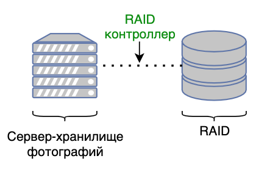

### 1. Выбор темы
Badoo/Tinder-подобный сервис

### 2. Определение возможного диапазона нагрузок

Значения Badoo (брал в основном с докладов на конференциях):
* 400 млн. зарегистрированных пользователей
* 300 тыс. регистраций в день
* 60 млн. активных пользователей
* несколько дата-центров, разнесенных по континентам
* ~ 4 петабайта фотографий (отдельный слой раздачи под это всё дело)
* 100 тыс. запросов за фотографиями (было 80 тыс. при 330 млн. зарег. пользователей)
* 120 тыс. запросов к продуктовым бэкендам (при 270 млн. пользователях было 70к на их php-бэкенды) (эти запросы пойдут в базу)
      
### 3. Выбор планируемой нагрузки

Для проектирования ограничимся значениями, в 5 раз меньшими:

* 12 млн. активных пользователей
* 1 петабайт фотографий
* 20 тыс. запросов за фотографиями
* 24 тыс. запросов в бэкенды
* географически ориентироваться будем на СНГ пространство

### 4. Логическая схема базы данных

The Tinder system has four requirements: storing profiles, recommendations, noting matches and chatting with matches. Storing profiles is trivial except for the image storage, where we argue on BLOB vs File storage. The distributed file architecture seems best when storing images.

В первом приближении наш сервис должен уметь (MVP):
* хранить профиль пользователя
* предоставлять рекомендации
* noting matches (пользователи пролайкали друг друга)
* чаты, между пользователями, которые пролайкали друг друга
* все это заправляется большим количество картинок

Разделим сервис на две большие части: продуктовые бэкенды и хранилище фотографий

### 5. Физические системы хранения

#### Схема бэкенда с фотографиями

* LRU Cache

* Сторадж-сервер с локальным RAID (дублируется через асинхронную очередь)

#### Пользовательские сессии
Для хранения пользовательских сессий нам нужно key-value хранилище.
Выбираем Redis. Можно было бы попробовать memcached, но в нём отсутствует нормальное коробочное решение для репликации, которое присутствует в Redis.

#### Пользовательская информация

RMDB

### 6. Выбор прочих технологий

Клиенты: веб + мобильный 

Продуктовые бэкенды пишутся под конкретные фичи (отходим от монолита)
С/С++/Go

### 7. Расчет нагрузки и потребного оборудования

### 8. Выбор хостинга / облачного провайдера и расположения серверов

Т.к. первым делом мы географически ориентируемся на СНГ, то для обеспечения комфортного latency для наших пользователей нам необходимо разворачиваться в дата-центре, находящемся на территории РФ. В случае отсутствия собственного дата-центра мы можем воспользоваться услугами следующих провайдеров:

* Mail.Ru Cloud Solutions
* Yandex.Cloud

### 9. Схема балансировки нагрузки (входящего трафика и внутрипроектного, терминация SSL)

За входящий трафик с клиентов отвечают инстансы Nginx'а с L7 схемой.

* алгоритм балансировки кэширующих прокси:
    Условный round-robin нам не подойдет, т.к. для обеспечения высокого попадания в кэш запрос за одной и той же фотографией всегда должен приходить на один и тот же прокси. Будем выбирать прокси по хэшу запрашиваемого URL, для обеспечения нормального горизонтального масштабирования будем использовать Consistent hashing https://en.wikipedia.org/wiki/Consistent_hashing

* продуктовые бэкенды могут балансироваться при помощи round-robin, т.к. для клиентов нет разницы в какой продуктовый бэкенд ходить

### 10. Обеспечение отказоустойчивости

Общее: 
* Резервирование балансировщиков с сохранением белого ip-адреса (если один из балансировщиков отказал, то в рамках того же белого ip-адреса будет отвечать другой балансировщик)

Фото:
* Резервирование кэширующего прокси (если один прокси упал, то балансировщик начинает отправлять запросы к зарезервированному прокси, который начинает набирать себе фотографии в кэш)
* Каждый storage-сервер дублируется, консистентность между основным и дублирующим сервером осуществляется за счёт асинхронной очереди (при загрузке в основной сторадж, в очередь кладется задача, которая потом должна будет загруженное содержимое залить в дублирующий сервер)

Продуктовые бэкенды:
* Отказоустойчивость обеспечивается k8s-кластером, который в случае падения одного из бэкендов, равномерно распределит нагрузку между работающими и начнёт автоматически переподнимать упавший