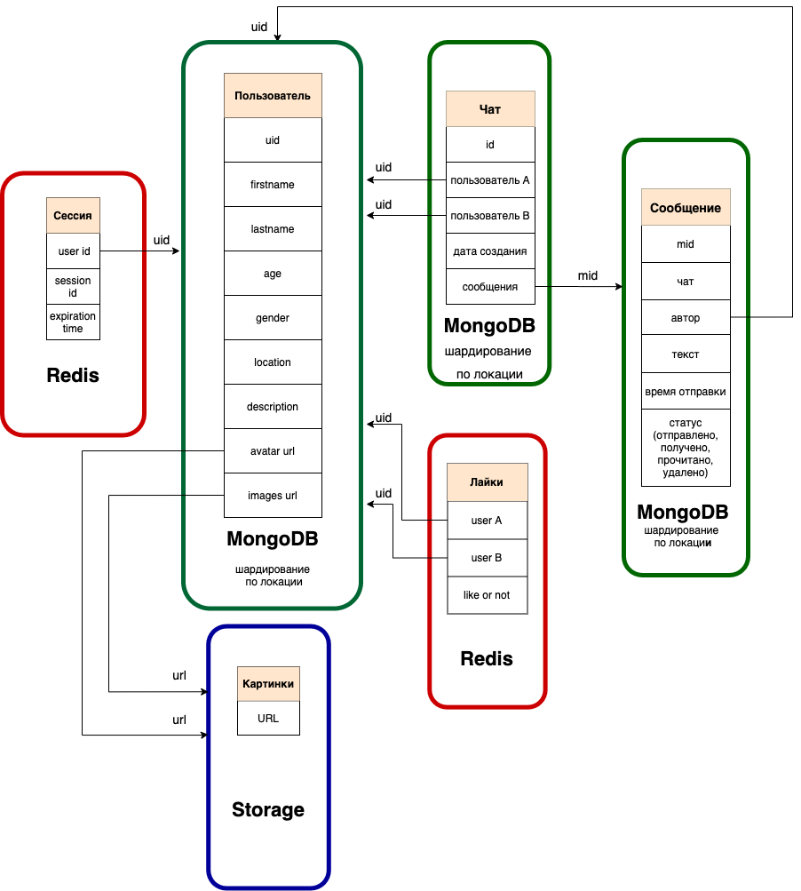
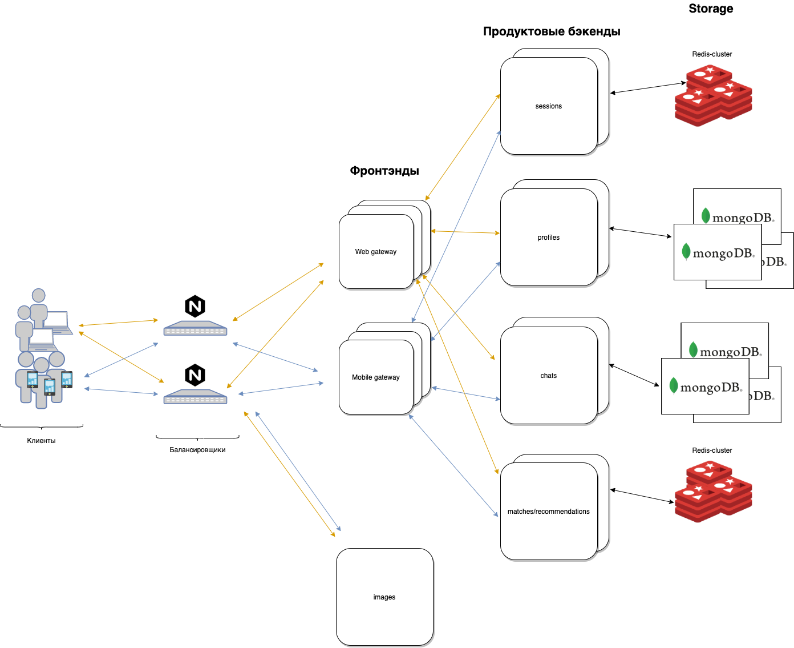
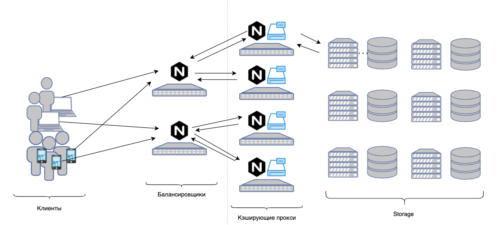
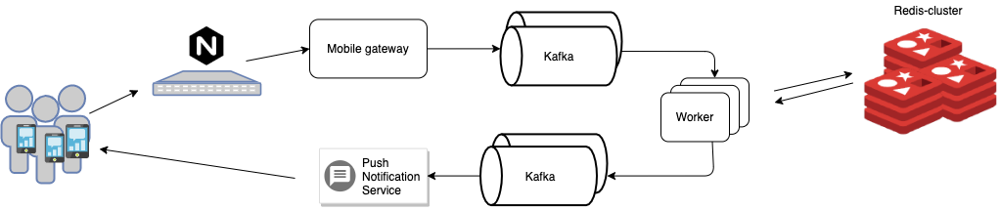

### 1. Выбор темы
Badoo/Tinder-подобный сервис

### 2. Определение возможного диапазона нагрузок

Значения Badoo (брал в основном с докладов на конференциях):
* 400 млн. зарегистрированных пользователей
* 300 тыс. регистраций в день
* 60 млн. активных пользователей
* несколько дата-центров, разнесенных по континентам
* ~ 4 петабайта фотографий (отдельный слой раздачи под это всё дело)
* 100 тыс. запросов за фотографиями (было 80 тыс. при 330 млн. зарег. пользователей)
* 120 тыс. запросов к продуктовым бэкендам (при 270 млн. пользователях было 70к на их php-бэкенды) (эти запросы пойдут в базу)
      
### 3. Выбор планируемой нагрузки 

Для проектирования ограничимся значениями, в 5 раз меньшими:

* 80 млн. зарегистрированных пользователей
* 12 млн. активных пользователей
* 1 петабайт фотографий
* 20 тыс. запросов за фотографиями
* 24 тыс. запросов в бэкенды
* географически ориентироваться будем на СНГ пространство

### 4. Логическая схема базы данных




В первом приближении наш сервис должен уметь (MVP):
* хранить профиль пользователя
* предоставлять рекомендации
* noting matches (пользователи пролайкали друг друга)
* чаты, между пользователями, которые пролайкали друг друга
* хранение и предоставление большого количество картинок


#### Профиль пользователя (лежит в MongoDB):

```
{
  "_id": "5cf0029caff5056591b0ce7d",
  "firstname": "Jane",
  "lastname": "Wu",
  "age": 24,
  "gender": "W",
  "location": {
    "city": "Moscow",
    "region": "Moscow"
  },
  "description": "Love dogs"
  "avatar_url": URL,
  "images_urls": [ URL1, URL2, URL3, URL4 ]
}
```

#### Сессии
Ключ - значение
 
```
"user_id" : [ {
	"sid": "4e45565b-24ee-47bd-9b2f-ed95d367a85f",
	"expires": "1608158921"
} ]
```

#### Cовпадения (Лайки)
Ключ - значение

```
"user_id1_user_id2": true
```


#### Общая схема


#### Схема бэкенда с фотографиями

#### Схема сервиса, обслуживающего совпадения



### 5. Физические системы хранения

|Сущность        |DBMS    | Шардирование |Реплицирование 
|:-------------- |:--------------|:-------------|:----------|
|1. Авторизация  | Redis             | -            | master-slave|
|2. Пользователь | MongoDB           | Geo          | master-slave |        
|3. Чат/сообщения| MongoDB           | Geo          | master-slave |  
|4. Лайки        | Redis             | -            | master-slave |
|5. Фотографии   | Файловая система  | Хэш урла     | резервирование через асинхронную очередь |


#### Занимаемое пространство на HDD
* Дисковое пространство для хранения профиля пользователя:

		300 Кб в среднем на один профиль, 80 млн. зарегистрированных пользователей, получаем 80 * 10^6 * 0,3 Мб = 24 Тб
		
* Дисковое пространство, для хранения фотографий:

		80 млн. зарегистрированных пользователей, у каждого в среднем по 4 фотографии, средним размером 4 МБ, объем хранилища 80 * 10^6 * 4 * 4 МБ.
		Получаем объем в 1,2 Петабайт. 

#### Занимаемое пространство на SSD

* Дисковое пространство, требуемое для кэширования фотографий:

		12 млн. активных пользователей, у каждого в среднем по 4 фотографии, средним размером 4 МБ, желаем получить cache hit 60%, тогда объем кэша 12 * 10^6 * 4 * 4 * 0,6 МБ.
		Получаем объем в 115 Тб. 


### 6. Выбор прочих технологий

* Клиенты: 

		Web: (CSS,HTML,TypeScript/JavaScript) 
		Mobile: (Native - Swift/Kotlin)  

* Бэкенды: 

		Основные сервисы на Go/С++, инфраструктурный код - Python, Lua 

### 7. Расчет нагрузки и потребного оборудования

С двухкратным запасом получаем:

	40 тыс. запросов за фотографиями
	48 тыс. запросов на фронтэнды, которые превращаются в: 
		48 тыс. запросов на проверку авторизации 
		10 тыс. запросов на микросервис пользователя (также и в MongoDB)
		10 тыс. запросов на микросервис чатов (также и в MongoDB)
		28 тыс. запросов на микросервис рекомендаций и лайков (также и в Redis)

В предположении, что на продуктовый бэкэнд будет прилетать по 100 rps на ядро, а на фронтэнд (Gateway) по 500 rps, получаем: 

|Узел            |Cores  | RAM  | Количество (репликация)  | 
|:-------------- |:----- |:-----|:------------|
|1. Фронтэнд     | 32    | 128  | 9 (3 мастера, 6 слейвов)| 
|2. Авторизация  | 32    | 128  | 9 (3 мастера, 6 слейвов)|      
|3. Пользователь | 16    | 64   | 9 (3 мастера, 6 слейвов)|
|3. Чаты         | 16    | 64   | 9 (3 мастера, 6 слейвов)|
|3. Лайки/Рекомендации | 32     | 64   | 12 (4 мастера, 8 слейвов)  
|3. БД (MongoDB + Redis) | 32    | 64   | 36 (12 мастеров, 24 слейва)| 
|3. Прокси фотографий | 36   | 128  | 8 (по 12 ТБ SSD)|

### 8. Выбор хостинга / облачного провайдера и расположения серверов

Для обеспечения комфортного latency и гео-шардирования необходимого выбрать провайдера с различным расположением дата-центров по России. Из доступных вариантов остановимся на Yandex.Cloud, т.к. в таком случае получаем покрытие 3 различных областей - Владимирской, Рязанской и Московской. 

### 9. Схема балансировки нагрузки (входящего трафика и внутрипроектного, терминация SSL)

За входящий трафик с клиентов отвечают инстансы Nginx'а с L7 схемой.

* алгоритм балансировки кэширующих прокси:
    Условный round-robin нам не подойдет, т.к. для обеспечения высокого попадания в кэш запрос за одной и той же фотографией всегда должен приходить на один и тот же прокси. Будем выбирать прокси по хэшу запрашиваемого URL, для обеспечения нормального горизонтального масштабирования будем использовать Consistent hashing https://en.wikipedia.org/wiki/Consistent_hashing


* продуктовые бэкенды могут балансироваться при помощи round-robin, т.к. для клиентов нет разницы в какой продуктовый бэкенд ходить


### 10. Обеспечение отказоустойчивости

Общее: 
* Резервирование балансировщиков с сохранением белого ip-адреса (Common Address Redundancy Protocol (CARP) - если один из балансировщиков отказал, то в рамках того же белого ip-адреса будет отвечать другой балансировщик)

Фото:
* Резервирование кэширующего прокси (если один прокси упал, то балансировщик начинает отправлять запросы к зарезервированному прокси, который начинает набирать себе фотографии в кэш)
* Каждый storage-сервер дублируется, консистентность между основным и дублирующим сервером осуществляется за счёт асинхронной очереди (при загрузке в основной сторадж, в очередь кладется задача, которая потом должна будет загруженное содержимое залить в дублирующий сервер)

Продуктовые бэкенды:
* Отказоустойчивость обеспечивается k8s-кластером, который в случае падения одного из бэкендов, равномерно распределит нагрузку между работающими и начнёт автоматически переподнимать упавший


